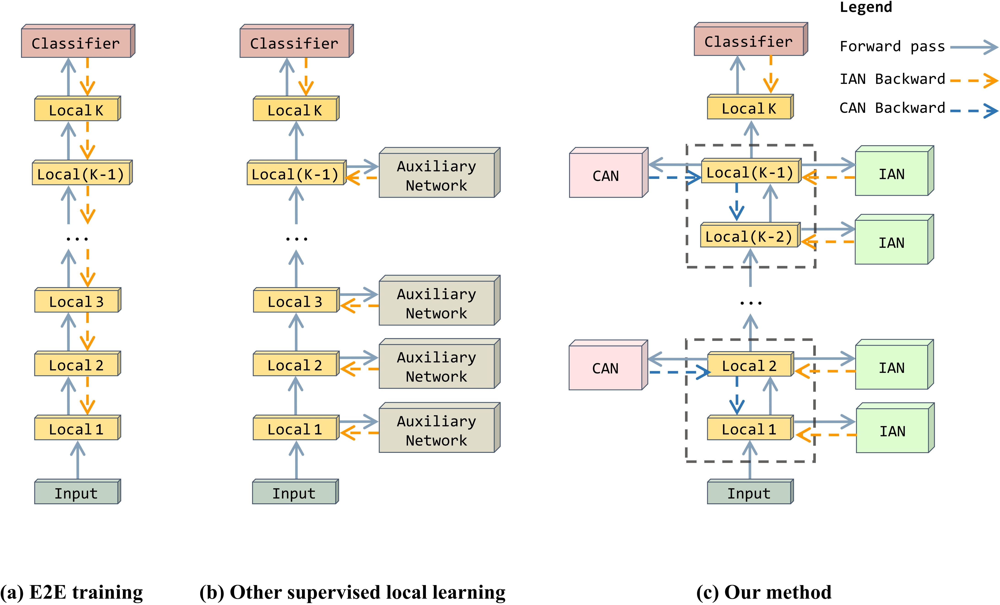

**HPFF**: Hierarchical Locally Supervised Learning with Patch Feature Fusion
========
PyTorch training code and pretrained models for **HPFF**.We use HPFF to optimize the Local-learning auxiliary network and achieve higher performance than E2E.


**What it is**. In this paper, published in ECCV 2024, we propose HPFF as a general method that can be applied to any local learning network. The experimental results show that the local learning network outperforms the end-to-end network after applying the HPFF method. Meanwhile, on some datasets like CIFAR-10, the GPU memory overhead can be reduced by 50%.

**About the code**. The code provides configuration parameters including HPFF for datasets of different sizes, as well as model code. Just download the dataset and call the command to run it directly.

## Training
To train a Resnet-32 baseline model with 16 Local-Modules on a small dataset such as CIFRA-10:
```
cd Exp on CIFAR_SVHN_STL
CUDA_VISIBLE_DEVICES=0 python train.py --dataset cifar10 --model resnet --layers 32 --droprate 0.0 --no 0 --cos_lr --local_module_num 16  --local_loss_mode cross_entropy --aux_net_widen 1 --aux_net_feature_dim 128 --ixx_1 5 --ixy_1 0.5 --ixx_2 0   --ixy_2 0
```
To train a Resnet-101 baseline model with 55 Local-Modules on a small dataset such as CIFRA-10:
```
CUDA_VISIBLE_DEVICES=0 python train.py --dataset cifar10 --model resnet --layers 110 --droprate 0.0 --no 0 --cos_lr --local_module_num 55 --local_loss_mode cross_entropy --aux_net_widen 1 --aux_net_feature_dim 128 --ixx_1 5 --ixy_1 0.5 --ixx_2 0   --ixy_2 0
```
