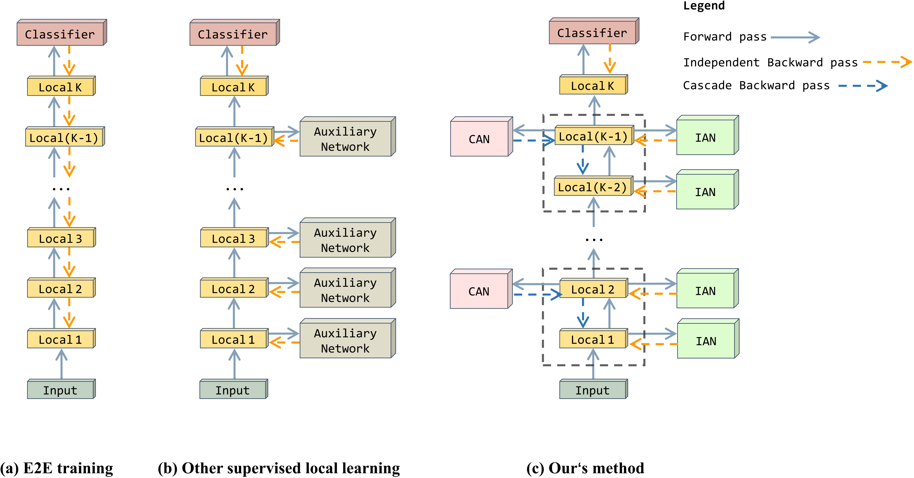

**HPFF**: Hierarchical Locally Supervised Learning with Patch Feature Fusion
========
PyTorch training code and pretrained models for **HPFF**.We use HPFF to optimize the Local-learning auxiliary network and achieve higher performance than E2E.

